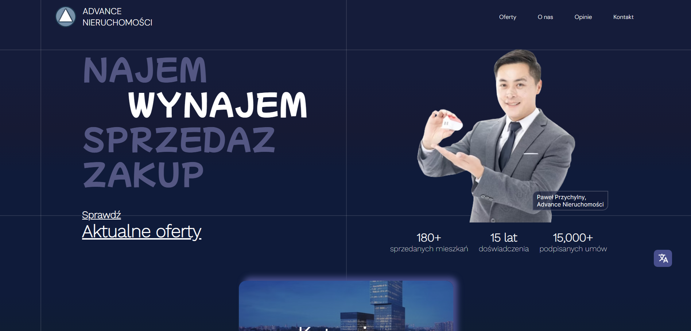

This project was built with [Next.js](https://nextjs.org/).

# **The Advance Nieruchomości App** 
The Advance Nieruchomości App is a platform for a real estate brokerage company.

With a focus on empowering agents and streamlining operations this app brings features like:

## Live: https://nieruchomosci.netlify.app/

## Features
- **Responsive Homepage:** Capture user attention with a user-friendly interface that provides all essential information at a glance.

- **Offers listing:** Easily sort and preview available properties for quick decision-making. 

- **Admin Dashboard:** Seamlessly add new listings and efficiently manage existing ones from a centralized control panel.

## Preview images 

 

 

 

### License: [MIT](https://github.com/m1ckeyyy/advance/blob/master/LICENSE)
